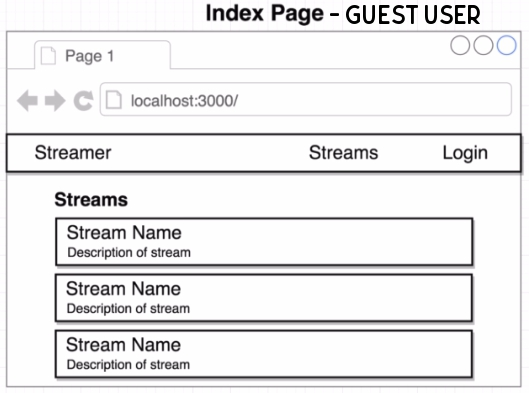
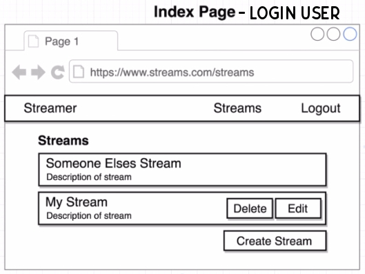
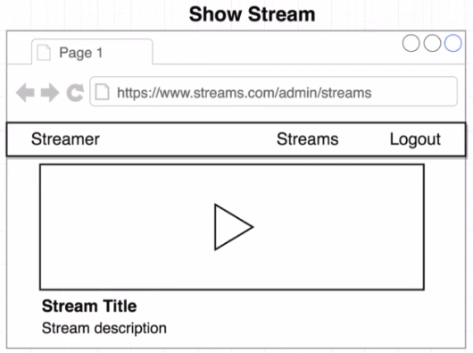
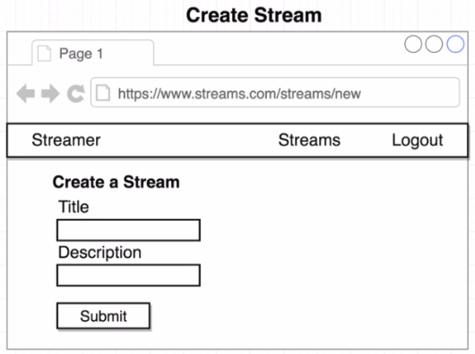
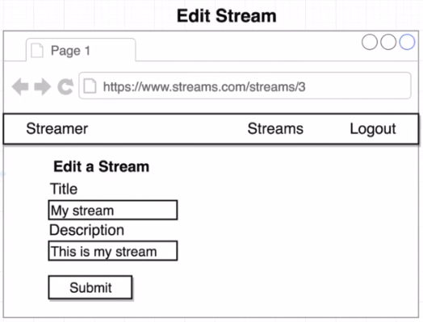
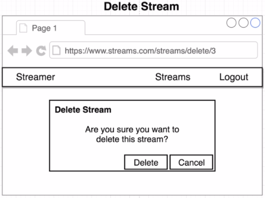
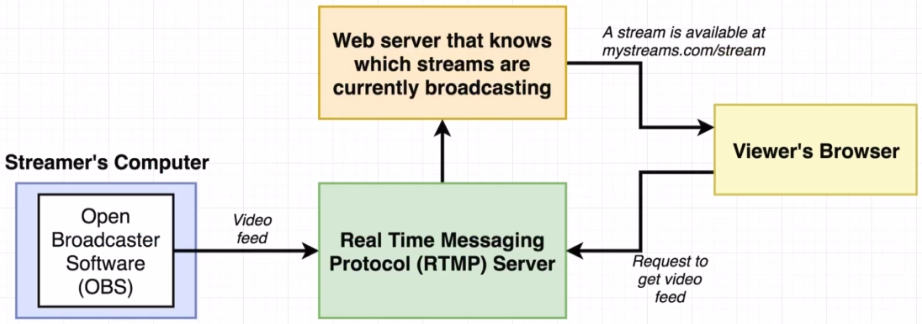
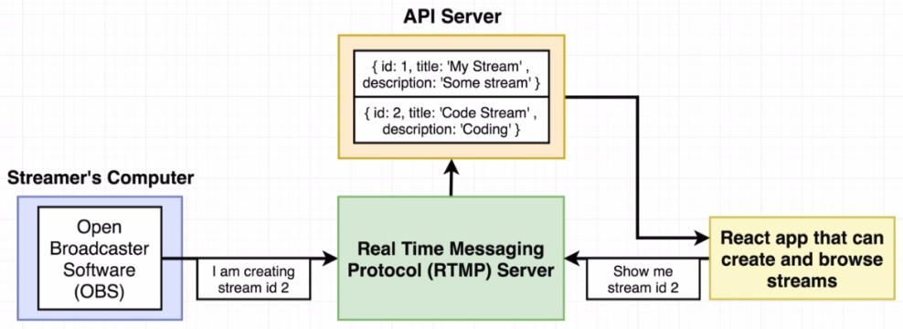
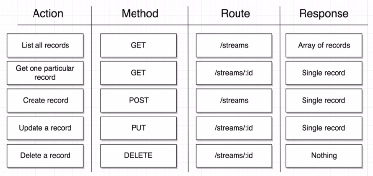

# Live Video Streaming

Allow users to create and show live streams.

### Concepts Learned

- React Router
- Router Types in Traditional Servers
- Handling Authentication
- Redux Dev Tools
- Redux Form
- JSON Server

## App Overview

  
  

  
  

  
  

## Project Setup

1. Create a new project and generate OAuth credentials from [here](https://console.developers.google.com).
2. Obtain the Client ID.
3. Rename the file _.env-sample_ inside the _client/_ directory to _.env_ and place your Client ID there.

## App Flow

High-level view:

Detailed view:

## Component Hierarchy

## Streams RESTful API Conventions

