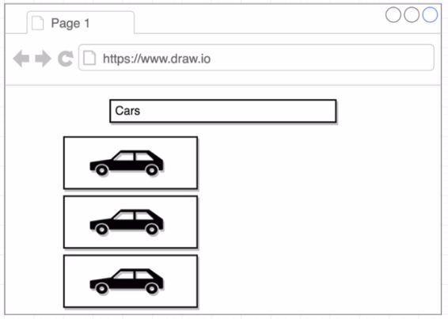
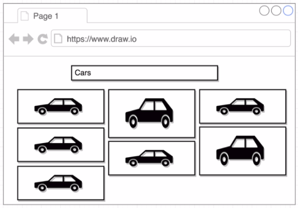
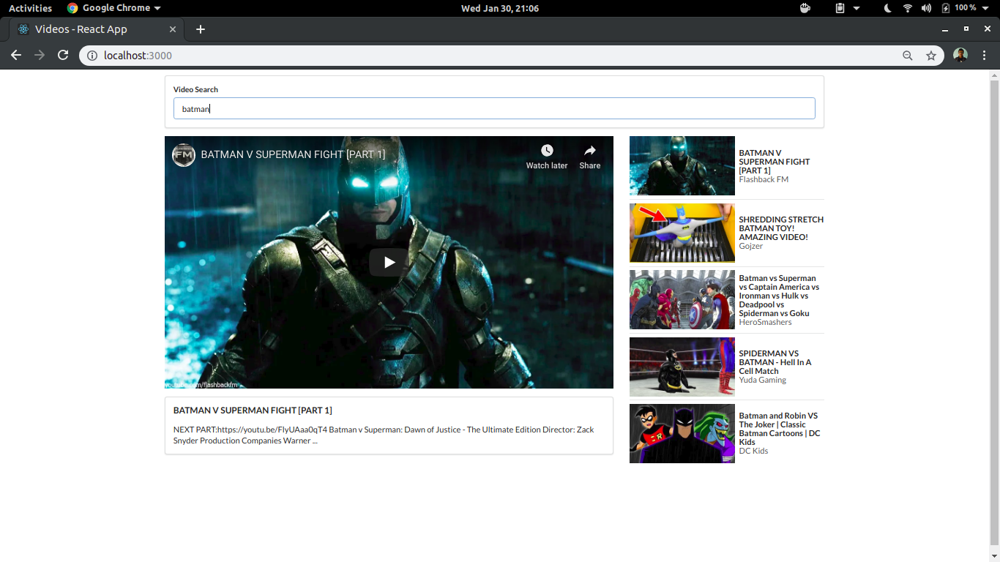

# Search and Display Images

Fetch and display images from a third-party API to show images to a user based on a query.

### Concepts Learned

- Handling User Input with Forms
- Event Handlers
- Uncontrolled vs Controlled Elements
- Context Management with `this` Keyword
- Communicating from Child to Parent
- Network Requests
- Rendering Lists
- React Refs for DOM Access
- Grid CSS System

## App Overview

### Version 1 Implementation:

Display a record of images.

### Version 2 Implementation:

Display images in a grid fashion considering the height of each image.

## Final Result

## Project Setup

1. Create a developer account [here](https://unsplash.com/developers).
2. Obtain the Access Keys.
3. Rename the file _.env-sample_ to _.env_ and place your access key there.
