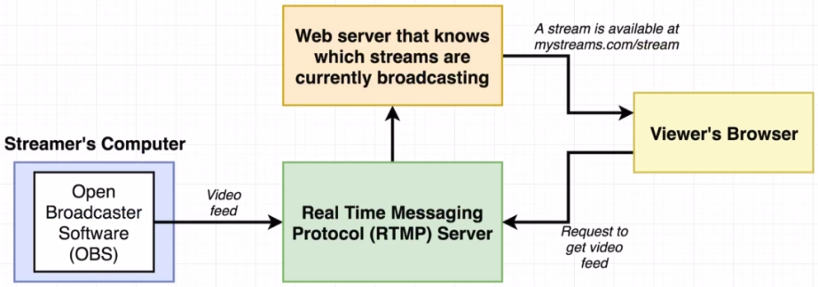

# Live Video Streaming

Allow users to create and show live streams.

### Concepts Learned

- React Router
- Router Types in Traditional Servers

## App Overview

  
  

  
  

  
  

## App Flow

## Component Hierarchy

