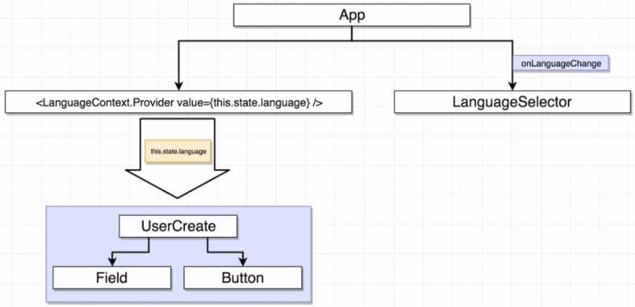

# Translate Form

Display a form in different languages.

### Concepts Learned

- Context System

## App Overview

## Before Commit [Replacing Redux with Context](https://github.com/shan18/React-with-Redux/tree/339201095518627a01483fb55af97bf566056ec1)

### App Flow

### Component Hierarchy

## After Commit [Replacing Redux with Context](https://github.com/shan18/React-with-Redux/tree/baaad2024ffb80f4439f1f538b43880041b670db)

### App Flow

