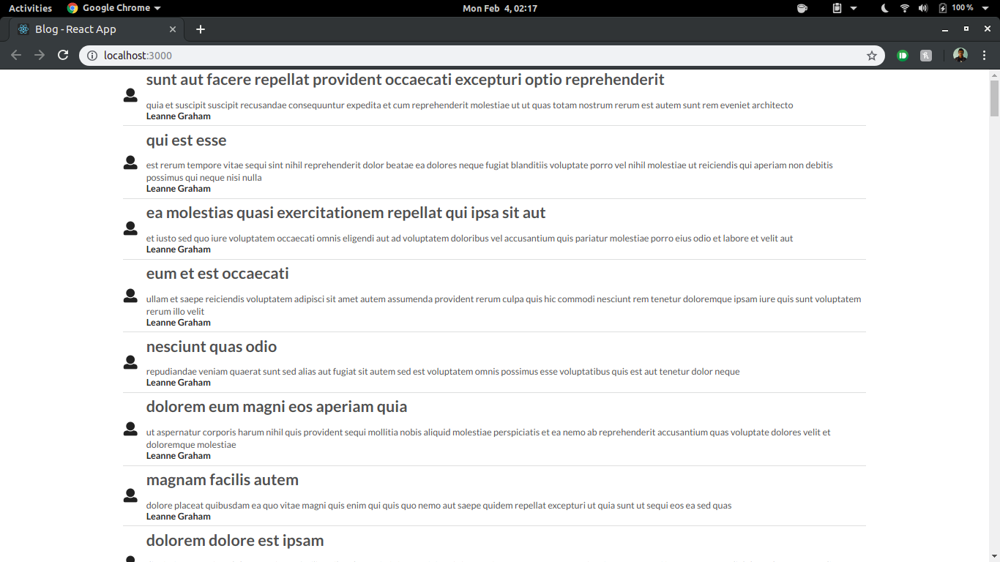

# Display Videos from YouTube

Play videos from YouTube API based on a query.

### Concepts Learned

- Deeply Nested Callbacks
- Revision of all the concepts learned previously

## App Overview

## Final Result

## Project Setup

1. Create a new project and generate an api key (for YouTube Data API v3) from [here](https://console.developers.google.com).
2. Obtain the Access Keys.
3. Rename the file _.env-sample_ to _.env_ and place your access key there.
