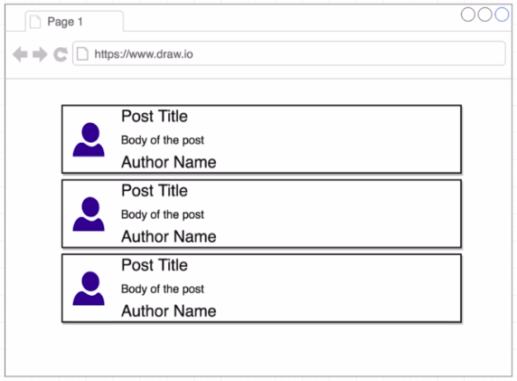
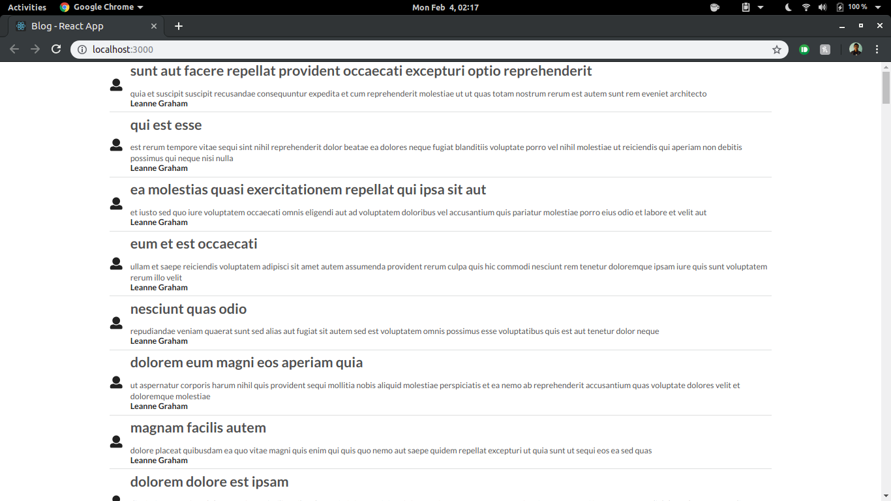

# Blog

Display blog posts along with usernames fetched from an API.

### Concepts Learned

- Network Requests with Redux
- Asynchronous Action Creators
- Middleware in Redux
- Redux Thunk
- Logic Extraction to mapStateToProps
- Rules of Reducers
- Switch statements in Reducers
- Handling Overfetching of Data
- Nesting Action Creators
- Lodash Package

## App Overview

## Final Result

