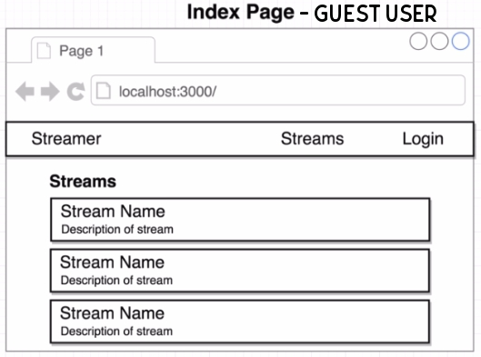
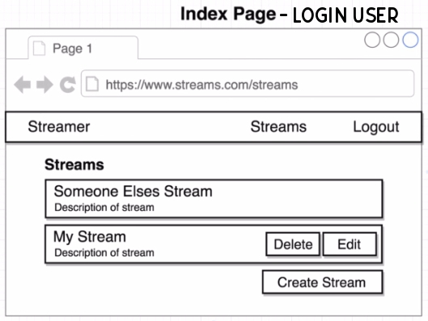
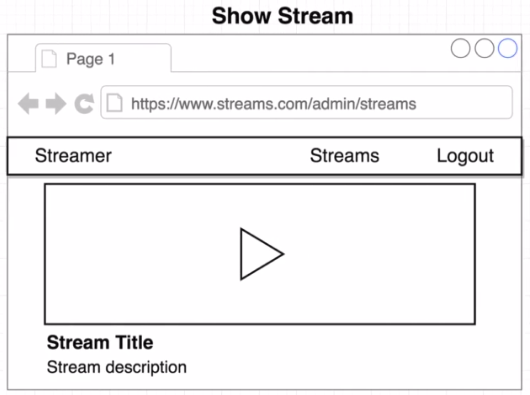
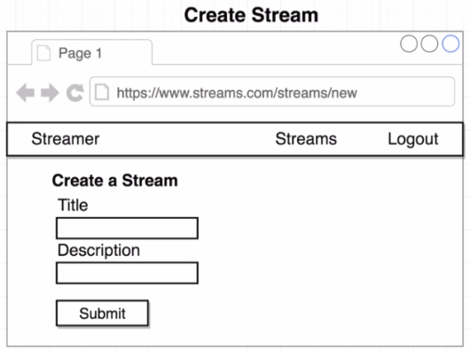
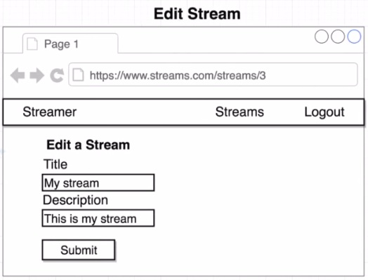
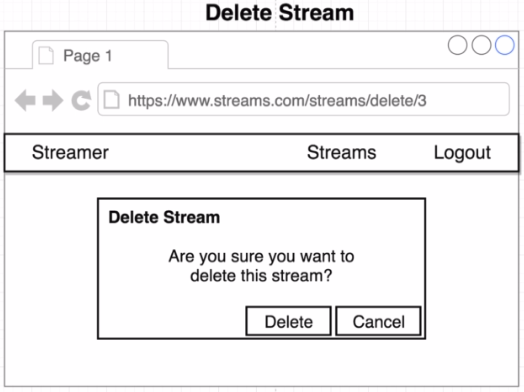
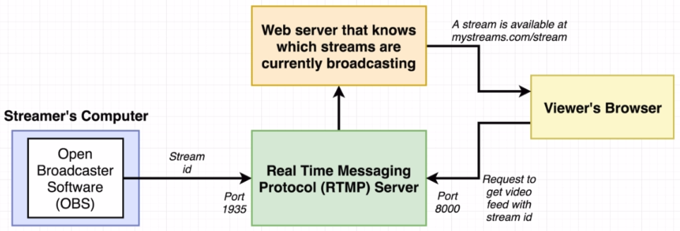
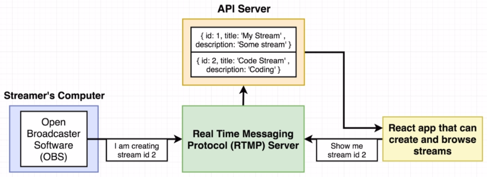
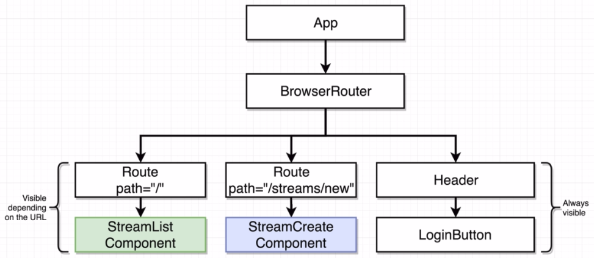
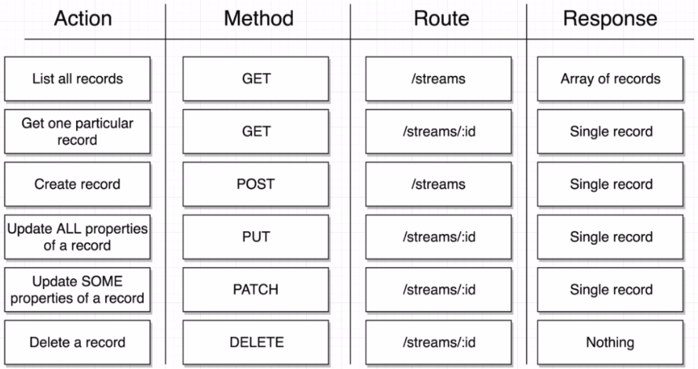

# Live Video Streaming

Allow users to create and show live streams.

### Concepts Learned

- React Router
- Router Types in Traditional Servers
- Switches with React Router
- Handling Authentication
- Redux Dev Tools
- Redux Form
- JSON Server
- REST-ful Conventions
- Programmatic Navigation
- Code Reuse
- Portals
- Event Propagation
- React Fragments
- RTMP Server (Node-Media-Server)
- Using _flv.js_ package

## App Overview

  
  

  
  

  
  

## Project Setup

The project contains three separate components stored in three different directories: _api_, _client_ and _rtmpserver_.

1. Open all the three directories in separate terminal windows and install dependencies for each of them with `$ npm install`.
2. Start the servers by executing `$ npm start` in all three components.
3. Create a new project and generate OAuth credentials from [here](https://console.developers.google.com).
4. Obtain the Client ID.
5. Rename the file _.env-sample_ inside the _client/_ directory to _.env_ and place your Client ID there.
6. Install OBS from [here](https://obsproject.com/).
7. In OBS, create a new scene and add the audio and video sources in that scene.
8. Setup OBS to use the RTMP server by following the instruction given [here](https://github.com/illuspas/Node-Media-Server#from-obs).
9. The stream-key should be the id of the stream at which the streaming video is to be displayed.

## App Flow

High-level view:

Detailed view:

## Component Hierarchy

## Streams RESTful API Conventions

